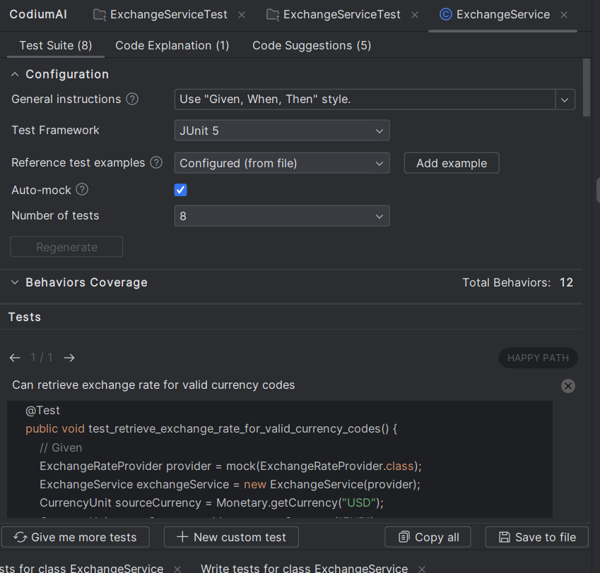
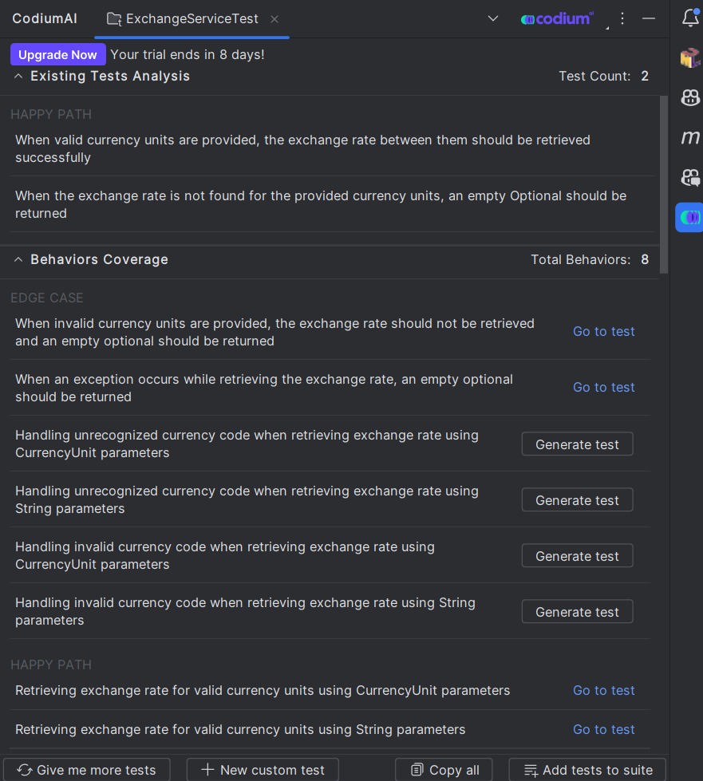
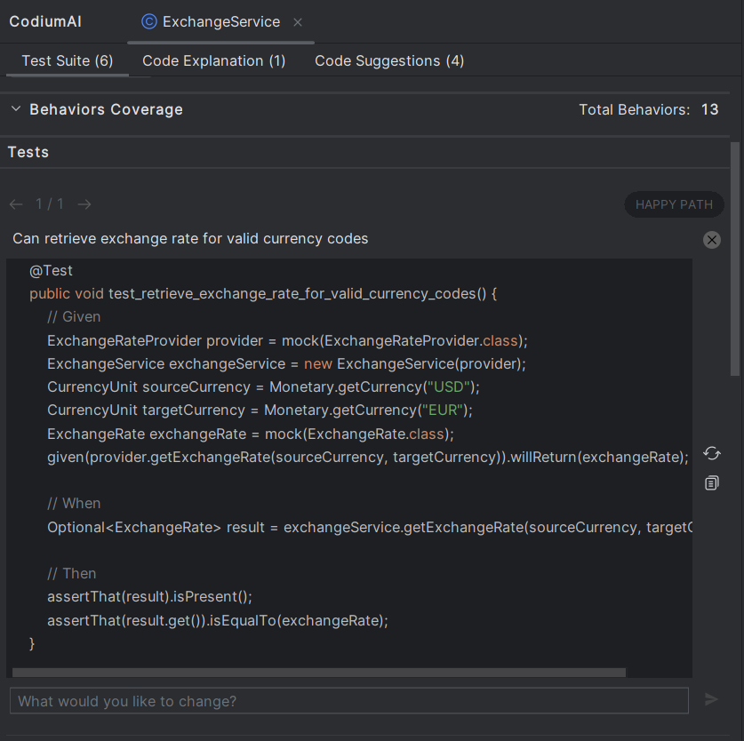
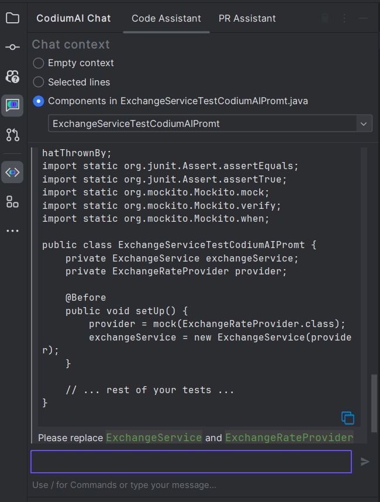
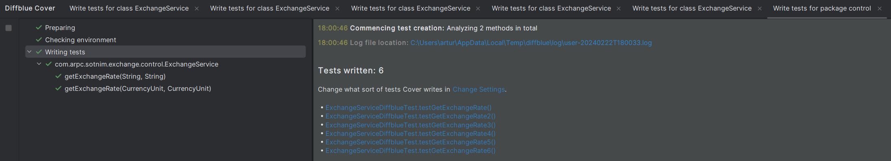

# AI test generation tool comparison

[In a hurry? TLDR at bottom](#tldr)

This repository compares the output of different AI test generation tools.

The tools evaluated are:

- [Diffblue](https://diffblue.com)
- [CodiumAI](https://www.codium.ai)
- Github Copilot Chat - with custom prompts

The goal of the exercise was to create unit tests for [ExchangeService.java](src/main/java/ExchangeService.java) which
performs type conversion and delegates to another service while handling some error scenarios through Optional.

## Intro
Tests are essential for any application.

If done right:
- they provide a safety net for refactoring
- document the expected behavior of the code
- ensure the application behaves as expected through dependency upgrade cycles

However, writing tests can be time-consuming and error-prone.

In many cases, I write tests in advance of the code under test, nevertheless, there are scenarios where
I wish for a faster and more efficient approach.

AI test generation tools aim to automate this process by generating tests based on the code and the expected behavior.

Does it mean you just gained 30-40% of your development time back? Let's find out.

## Deep dive
### CodiumAI
CodiumAI has a free version for VS Code and JetBrains products.
It not only generates tests but also provides code explanation, code improvement suggestions, and a chat feature. [[ref]](https://www.codium.ai/products/ide-plugin/)

Here's how its main panel looks in action using a predefined prompt:


CodiumAI's main strength of CodiumAI is its approach of first generating Behaviours Coverage (test plan) in natural language and then converting them to tests.
I like this approach because it hints to the developer about the value of test design and allows for early intervention without the burden of implementation details.


Additionally, each generated test is previewed and can be further tweaked by additional prompts.


I evaluated CodiumAI using multiple strategies:
#### 1. Let CodiumAI generate tests without any custom instructions
[ExchangeServiceCodiumPlainTest](src/test/java/com/arpc/aitests/ExchangeServiceCodiumPlainTest.java)

After clicking the "Save to file" button for the 8 tests in the preview, CodiumAI generated a file without a package name and static imports missing.
With minimal changes I got most tests working and some I had to disable since the CurrencyUnit type couldn't be
initialized with invalid currency `Monetary.getCurrency("NONEXISTENT");` as the test intended.

Each test had a comment with the behavior description, it must assist the tool with maintenance of tests in the future. Since this information is partially duplicated in the method name, I am sure developers wouldn't want to write it by hand. I wouldn't.

#### 2. Let CodiumAI generate tests with the custom prompt I used for GitHub Copilot
[ExchangeServiceCodiumPromtTest](src/test/java/com/arpc/aitests/ExchangeServiceCodiumPromtTest.java)

The initial result was decent, but the repeating setup code in each test was slightly verbose, making it difficult to add new test cases easily. Since you would need to repeat all the setup code.

In addition, the test output didn't match my go-to style for unit tests, so I decided to try a custom prompt in "General Instructions" to see if I could get better results.
The prompt is available in the Github Copilot [section](#Github Copilot).

The code it created followed the instructions but lacked fields intended for reuse and `@BeforeEach` method which the tests relied on.

It was easy enough to fix the test by hand or ask CodiumAI Chat to fix it for me:


#### 3. Let CodiumAI add additional test cases for handwritten test file with just 2 scenarios
[ExchangeServiceTest](src/test/java/com/arpc/aitests/ExchangeServiceTest.java)

By far the best outcome was achieved when I wrote 2 tests by hand and then asked CodiumAI to add additional tests.
They reused the helper class I had created and followed the same style of tests .


### Diffblue
Diffblue is a commercial product that also offers a free community plugin.
Its main feature is generating tests for a whole project. However, this feature is only available in
the commercial version and today's experiment focuses on a single class.

It's easy to use!

After installing the plugin you can quickly generate tests with just one click.


A few moments later

A new file [ExchangeServiceDiffblueTest](src/test/java/com/arpc/aitests/ExchangeServiceDiffblueTest.java) was generated. 
To my surprise, it compiled and passed all the tests it had written. However, regarding the test quality, I believe there's room for improvement. Please see the code for yourself!

### Github Copilot
Most of the developers I know are using some Generative AI chat in their work. So I decided to add GitHub Copilot to the mix.

Aside. I have seen some companies trying to boost their value offering by including a library of prompts.
Here is one prompt, completely for free... you are welcome 🤭

This is the prompt I used for Copilot to generate tests. Since it can add context automatically I didn't have to add ExchangeService.java code explicitly.
```
Write jUnit test where: 
1) method names must start with "should" and can have "When"
1) don't use underscores in method names
2) Tests should be exhaustive and cover all edge cases
3) reuse fields initiated before test to reduce code repetition
4) utilize helper methods to reduce code repetition between tests
5) Output only the code
6) Use assertJ assertions
7) Use Lombok builders when possible
8) Use helpers and test doubles from existing context if appropriate
```

The generated code used fields and setUp method to make tests succinct and easy to read.
There were similar compilation issues related to incorrect usage of the `javax.money` API.
While I would have preferred additional test scenarios, like providing the same currency for both source and target, 
the overall attempt was solid.

## Conclusion


[Go player beating AI](https://arstechnica.com/information-technology/2023/02/man-beats-machine-at-go-in-human-victory-over-ai/)

[Is AI Actually Useful? by Patrick Boyle](https://www.youtube.com/watch?v=FTs35x-xUg4)

## TLDR
Best results were achieved when writing a few tests by hand and then asking CodiumAI [to add additional tests](https://github.com/arturs-razmuss/ai-tests/blob/master/src/test/java/com/arpc/aitests/ExchangeServiceTest.java#L63-L122)

You can likely achieve similar results with multiple, well-crafted prompts in Copilot, but it wouldn't be as convenient as using CodiumAI.

Legend:
🟢 Yes - succeeded
🟡 no - partially succeeded
🟠 no - attempted, but wasn't successful
🔴 no - failed

|                                                            | CodiumAI | comment                                                                                                                                                                                                | Diffblue | comment                                                                                                                                                                                  | Copilot | comment                                                                                                                        | 
|------------------------------------------------------------|----------|--------------------------------------------------------------------------------------------------------------------------------------------------------------------------------------------------------|----------|------------------------------------------------------------------------------------------------------------------------------------------------------------------------------------------|---------|--------------------------------------------------------------------------------------------------------------------------------|
| Compiled without any edits                                 | 🔴 no    | [missing static imports and package](https://github.com/arturs-razmuss/ai-tests/commit/c39e2c83d732ebd5f06cd2dbae839f819ecfe7ea#diff-fbacc4b894c29cc3a06d33c4605c53d753c18ec0c3b886d977c78bc8ea3eee27) | 🟢 Yes   |                                                                                                                                                                                          | 🔴 no   | [invalid usage of javax.money API](https://github.com/arturs-razmuss/ai-tests/commit/54e9585aca4334123c912f2019d066b63a2f926c) |
| Tests passed without any edits                             | 🔴 no    | compilation didn't pass                                                                                                                                                                                | 🟢 Yes   |                                                                                                                                                                                          | 🔴 no   | compilation didn't pass                                                                                                        |
| Produced rich set of test cases                            | 🟢 Yes   |                                                                                                                                                                                                        | 🟡 no         | lacked test different target and source currency                                                                                                                                         | 🟡 no   | lacked same currency input for source and target                                                                               |
| Assertions were of acceptable quality                      | 🟢 Yes   |                                                                                                                                                                                                        | 🔴 no         | Only asserting presence of Optional                                                                                                                                                      | 🟢 Yes   |                                                                                                                                |
| Supports custom prompts                                    | 🟢 Yes   |                                                                                                                                                                                                        | 🔴 no    |                                                                                                                                                                                          | 🟢 Yes  |                                                                                                                                |
| Descriptive test name                                      | 🟢 Yes   |                                                                                                                                                                                                        | 🔴 no    | [test names or comments don't provide meaning](https://github.com/arturs-razmuss/ai-tests/blob/master/src/test/java/com/arpc/aitests/ExchangeServiceDiffblueTest.java) | 🟢 Yes  |                                                                                                                                |
| Used fields and constants to reduce repetition inside test | 🟠 no    | [attempted when promted](https://github.com/arturs-razmuss/ai-tests/commit/c39e2c83d732ebd5f06cd2dbae839f819ecfe7ea#diff-336e4dab606c9690011ede09821a2772b1d6e53274d45e406a77da705db521b2)             | 🟠 no    |                                                                                                                                                                                          | 🟢 Yes  |                                                                                                                                |
